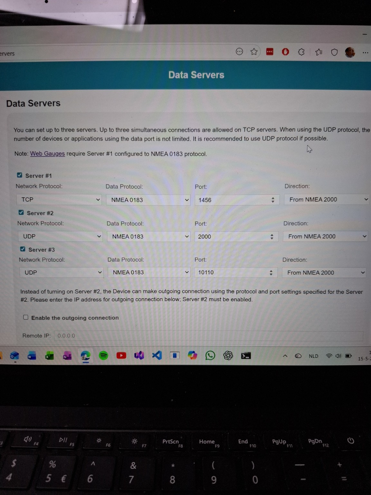

# YDEN-03 – Gateway NMEA 2000 naar netwerk

**Datum:** 2026-05-17

---

## Wat is de YDEN-03?

De **YDEN-03** is een netwerkgateway die NMEA 2000-busdata omzet naar netwerkverkeer (UDP/TCP).
Op de fysieke boot is de YDEN-03 de brug tussen de NMEA 2000-bus en het lokale netwerk.

---

## Huidige configuratie

De YDEN-03 is geconfigureerd met de volgende instellingen:

| Parameter | Waarde |
|-----------|--------|
| **Direction** | From NMEA 2000 |
| **Output formaat** | NMEA 0183 |
| **UDP poort 1** | 2000 |
| **UDP poort 2** | 10110 |
| **TCP poort** | 1456 |

De YDEN-03 stuurt NMEA 2000-data dus **als NMEA 0183 sentences** via UDP en TCP het netwerk op.



---

## Consequentie voor BootManager

Omdat de YDEN-03 NMEA 0183 uitzendt in plaats van raw NMEA 2000, moet BootManager NMEA 0183 sentences kunnen ontvangen en verwerken.

Dit is de directe aanleiding voor de **NMEA 0183 Support epic**.

Zie: [.docs/epics/nmea0183-support.md](./../epics/nmea0183-support.md)

---

## UDP-poorten relevant voor Ingest

Voor de NMEA 0183 UDP listener in Ingest zijn de YDEN-03 UDP poorten relevant:

- **Poort 2000** – primaire NMEA 0183 UDP output
- **Poort 10110** – alternatieve NMEA 0183 UDP output (standaard NMEA 0183 over IP poortnummer)

Ingest hoeft het IP-adres van de YDEN-03 niet te kennen.
Luisteren op `0.0.0.0` (of een configureerbaar lokaal adres) is voldoende.
De remote endpoint (YDEN-03 IP) kan als `Source` worden vastgelegd op het `NetworkMessage`.

Tijdens de Raspberry Pi deploymentvoorbereiding is bevestigd dat de boot-test waarschijnlijk via UDP broadcast verloopt. De YDEN hoeft dan geen vast Raspberry Pi IP-adres te kennen.

Voorwaarden:

- YDEN-03 en Raspberry Pi zitten in hetzelfde LAN/subnet.
- De UDP-poort op de YDEN komt overeen met de Ingest listener, standaard `10110`.
- Broadcast gaat normaal niet over router-, VLAN- of gastnetwerkgrenzen.

Boot-test checklist op de Pi:

```bash
hostname -I
cd ~/BootManagerV2
docker compose ps
docker compose logs -f bootmanager-ingest
```

In een tweede SSH-sessie:

```bash
sudo apt install -y tcpdump
sudo tcpdump -i any udp port 10110
```

Interpretatie:

- Als `tcpdump` pakketten toont maar BootManager niets verwerkt, zit het probleem vermoedelijk in Ingest/configuratie/parser.
- Als `tcpdump` niets toont, zit het probleem vermoedelijk in netwerk/YDEN/Teltonika/subnet/broadcast.

---

## TCP

De YDEN-03 biedt ook TCP op poort **1456** aan.
TCP-ondersteuning in Ingest is buiten scope voor de eerste NMEA 0183 codefase.

---

*Aangemaakt: 2026-05-17*
